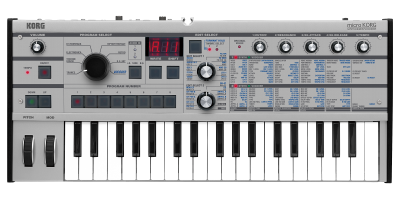

[`↞` Back to **README.md**](../README.md)

	<b>Korg</b> is named after the <b>KORG MicroKorg</b> synthesizer, which has a dedicated <i>attack</i> knob (Knob 3).  (Source: <a href="https://cdn.korg.com/us/support/download/files/8f226053113b3be59753dcce14e74cca.pdf">KORG MicroKorg Owner's Manual, page 9</a>).  Image below courtesty of <a href="https://www.korg.com/us/products/synthesizers/microkorg/">KORG</a>.
	  
	

* TOC
{:toc}

# What is Korg?

Korg is a tool for *attacker synthesis*.  Specifically, given:

* a system model `P`, called the "target process";
* a model `Q` called the "vulnerable process"
  * with interface `IO`;
* and a property `phi`,
  * where `P || Q |= phi`,

Korg will try to generate a new process `A` called an attacker that has the interface `IO` and violates `phi` when composed with `P`.

Intuitively, Korg assumes the adversary can "hack" a process `Q` in an environment `P`, and attempts to prove that in so doing, an adversary might induce `P` to violate `phi`.  The `IO` is used to stop the adversary from performing actions that `Q` could never perform in the first place.

# How can I install Korg?

See the [install docs](Install.md).

# How can I use Korg?

See the [usage docs](Usage.md).

## ... using the Makefile

Read the `#comments` in the [Makefile](../Makefile).  *TL;DR:*

* To run `experiment1` without recovery, do `make experiment1`.
* To run `experiment2` or `experiment3`, change `--phi=demo/TCP/phi1.pml` to `--phi=demo/TCP/phi2.pml` or `--phi=demo/TCP/phi3.pml` in the `experiment1` target.  Then do `make experiment1`.
* To run `experiment1` with recovery, change `--with_recovery=False` to `--with_recovery=True` in the `experiment1` target, then do `make experiment1`.
* To reproduce our results, do `make avgExperiment`.
* To run unit tests for main body of `Korg` logic, do `make testKorg`.
* To run unit tests for `Characterize.py`, do `make testChar`.
* To run unit tests for `Construct.py`, do `make testCons`.
* To run all the unit tests, do `make test`.
* To clean up after running one of the targets, do `make clean`.

## ... using Bash

See the [Usage docs](Usage.md), or, adapt the commands in the Makefile to your needs.

## ... using Windows

Use `Cygwin`, or, a [virtual machine](https://www.virtualbox.org/), or, [the Linux Subsystem](https://docs.microsoft.com/en-us/windows/wsl/install-win10).

* Please use the [Issue Tracker](https://github.com/maxvonhippel/AttackerSynthesis/issues) to report any issues.  We have not yet tested on Windows.

## I ran Korg on my threat model.  Now, how do I interpret the results?

See [interpreting outputs](InterpretingOutputs.md).

## Help!  It's not working!

See [troubleshooting](Troubleshooting.md).